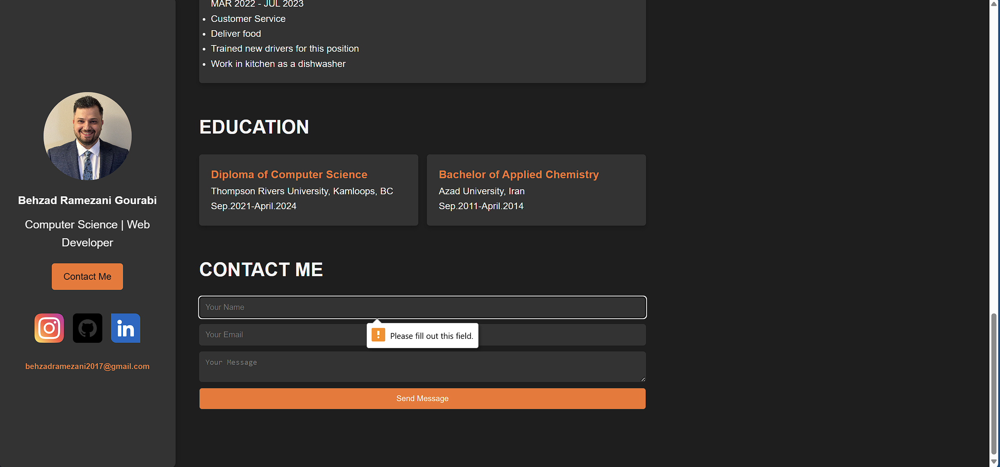

# Behzad Ramezani Portfolio Website

This is the portfolio website of Behzad Ramezani, a Computer Science graduate and Web Developer. The website showcases personal qualifications, skills, projects, experience, and contact information. It also includes a contact form that allows visitors to send messages, which are stored in a MySQL database.

## Features

- **Hero Section**: A fixed sidebar with profile information and contact button.
- **Smooth Scrolling Navigation**: Scrolling navigation to sections on the same page.
- **Skills Section**: A display of programming languages, web development tools, and personal qualities.
- **Projects Section**: A list of personal projects developed using various technologies.
- **Experience Section**: A history of work and academic experience.
- **Contact Form**: A form to collect visitor messages, submitted via AJAX.
- **Message Notifications**: Success or error notifications after form submission.

## Technologies Used

- **Frontend**:
  - HTML
  - CSS
  - JavaScript (with jQuery)
  - FontAwesome (for social icons)

- **Backend**:
  - PHP
  - MySQL (for database storage)

- **Tools**:
  - Visual Studio Code (for development)
  - Apache + MySQL (server stack)

## Setup Instructions

To run this portfolio website locally, follow these steps:

### Prerequisites

1. Install a local server environment such as **XAMPP** or **WAMP**.
2. Install a code editor (e.g., Visual Studio Code).

### Steps to Set Up

1. **Clone the repository**:
   ```bash
   git clone https://github.com/yourusername/portfolio-website.git


|  |  |  |
|--------------------------------------|--------------------------------------|--------------------------------------|
|  |  |  |
